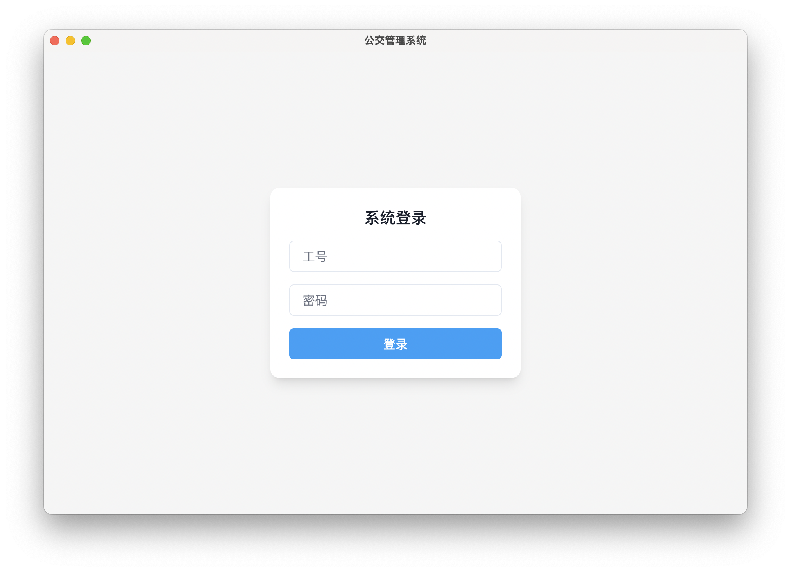
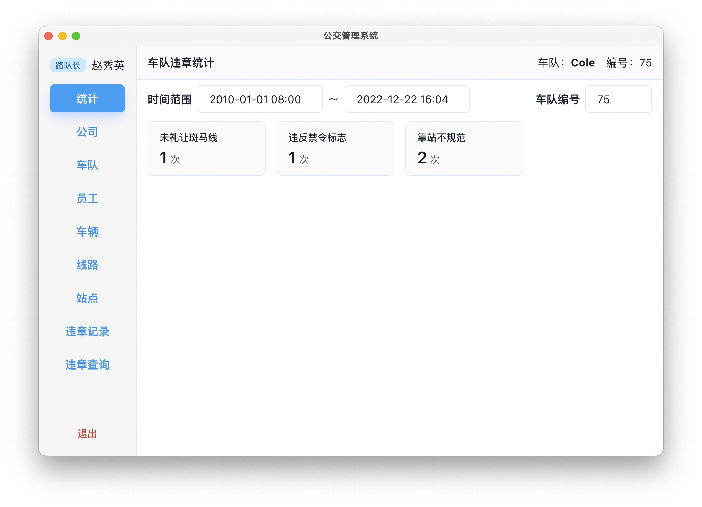
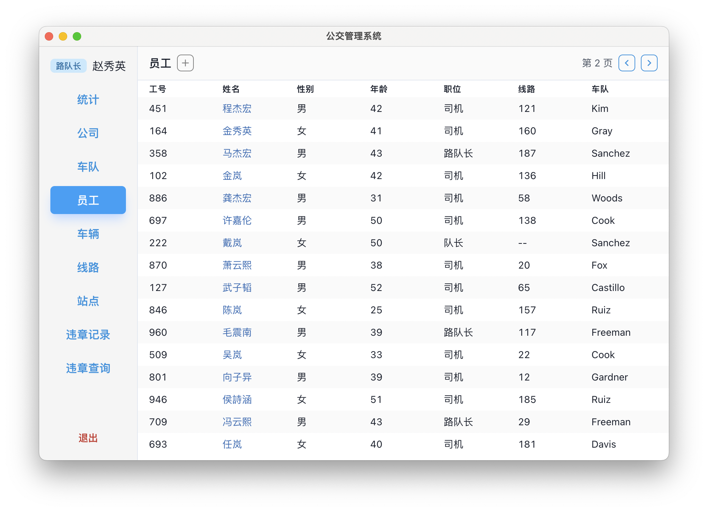
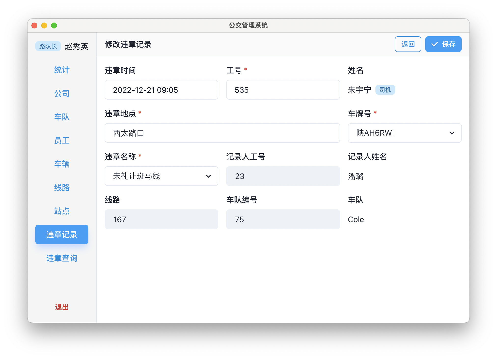

# Transit Manage

XDU 数据库系统大作业。后端数据库使用 PostgreSQL，前端使用 Electron + React。

由于作业未要求，该系统并未做明确的权限划分，不过自己是不可以编辑自己的违章记录的哦。

## 功能概览
1. 录入司机信息
2. 录入车辆信息
3. 录入违章信息
4. 查询车队下的司机
5. 查询司机的违章
6. 车队违章统计

## 界面预览

